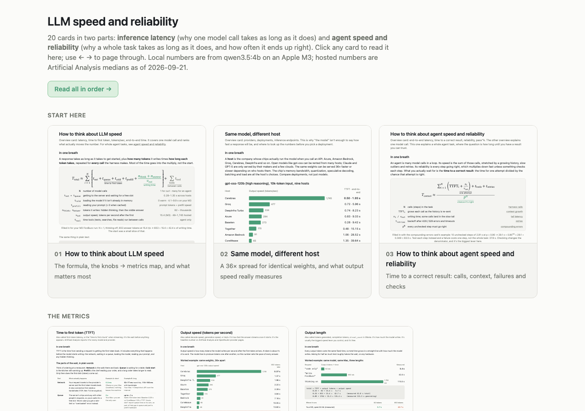
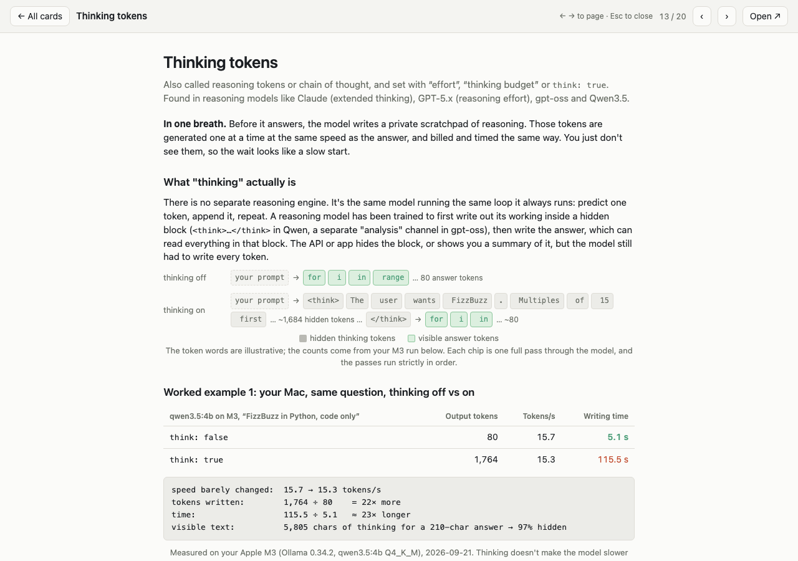
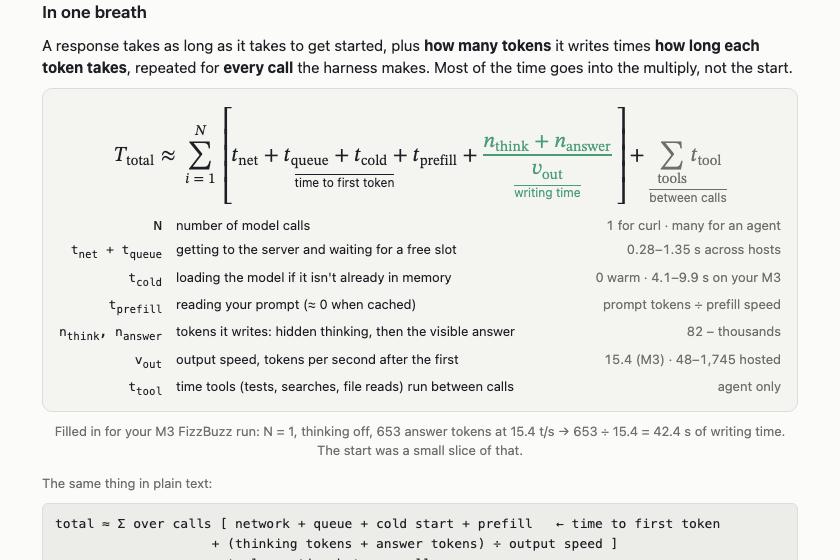
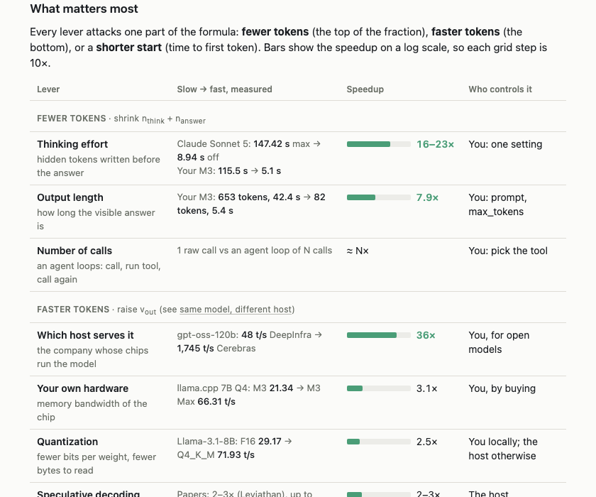
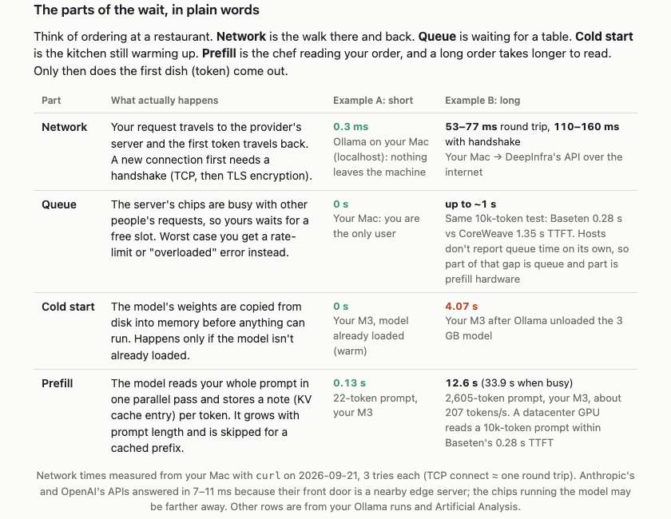
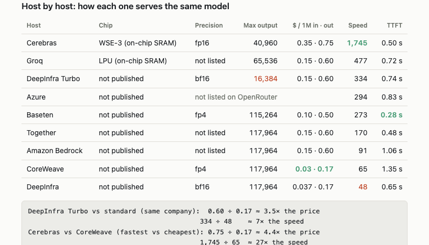

# concept-curriculum

A [Claude Code](https://claude.com/claude-code) skill that turns *"help me understand LLM latency"* or
*"explain how Postgres concurrency works"* into a **whole visual course**: a mapped set of
explainer cards that share one running example, use numbers measured on your own machine, end
with overview cards that tie it all together, and open as a gallery you can page through.

It builds on [concept-explainer](https://github.com/seyonv/concept-explainer), which makes one
card. This skill handles everything a *set* needs that a single card doesn't.

**[Browse the live example →](https://seyonv.github.io/concept-curriculum/examples/llm-latency/)** 20 cards on LLM speed and reliability, generated with this skill.



*The index of the included example, 20 cards on LLM speed and reliability. Each tile is a live
preview of the card.*



*Click any card to read it on the page. ← → pages through the whole course, Esc goes back, and the
URL (`index.html#thinking-tokens`) links straight to one card.*

---

## Why a curriculum skill

Ask for one card on a topic and you get a good card. Ask for fifteen and the cracks show: numbers
that disagree between cards, a formula that is only monospace text, terms named in a diagram but
never defined, an overview written before the cards it summarises, a plain list of links, and
nothing checking that it all renders. The included example set was built by fixing each of those,
one follow-up request at a time. This skill makes those fixes the default.

## What it adds on top of concept-explainer

1. **Maps the topic first.** It researches the topic, then proposes a path from simple to
   systemic: overviews → metrics → mechanisms → multipliers → the system level.
2. **A built-in gap check.** Before writing anything it asks *"what would a practitioner say is
   missing?"*: the system level, variance and the slow tail, failure and retries, cost, how you'd
   measure it yourself, and what the field calls things.
3. **One shared facts file.** `_facts.md` holds your setup, one running example, every shared
   number with its source and date, the term names and the colour meanings. Every card writer
   reads it, which keeps parallel cards consistent.
4. **Measure before citing.** It measures on your own setup where it can, against throwaway data.
   Everything else gets a cited source, and anything made up is labelled *illustrative* on the
   card.
5. **Parallel card writing.** One subagent per card, all with the same brief. The overview cards
   are written last, from the finished cards' numbers, so nothing contradicts.
6. **Default patterns** that make cards easier to read (shown below).
7. **A gallery index** with live previews, an on-page reader and deep links.
8. **A verification gate.** One command checks every page in its own private headless Chrome.

## What the cards look like

**A typeset formula**, with a key for every symbol and one worked example filled in. It's native
MathML, so it needs no script and no library.



**Ranked levers grouped by what they change**, with slow → fast numbers and speedups on a log
scale.



**Every term gets a plain definition and two real examples side by side**, plus an everyday
analogy.



**A comparison table whenever the answer depends on who runs it**: real configurations, prices
and measured outcomes, with "not published" where a provider doesn't say.



Colours mean the same thing on every card (for example, hidden thinking is always grey and the
visible answer always green), and every card reads in light and dark mode.

## Install

Skills live in `~/.claude/skills/<name>/`. This one needs concept-explainer alongside it.

```bash
# concept-explainer (makes each card)
git clone https://github.com/seyonv/concept-explainer.git
mkdir -p ~/.claude/skills/concept-explainer
cp concept-explainer/SKILL.md concept-explainer/template.html ~/.claude/skills/concept-explainer/
cp -r concept-explainer/examples ~/.claude/skills/concept-explainer/

# concept-curriculum (this skill)
git clone https://github.com/seyonv/concept-curriculum.git
mkdir -p ~/.claude/skills/concept-curriculum
cp concept-curriculum/{SKILL.md,patterns.md,card-brief.md,facts-template.md,index-gallery.html,verify.mjs} \
   ~/.claude/skills/concept-curriculum/
```

**Requirements:** Node 22 or newer and Google Chrome (or Chromium) for the verification gate. Set
`CHROME_PATH` if Chrome lives somewhere unusual. Nothing else, and there's no `npm install`.

## Use

In Claude Code:

```
/concept-curriculum how database transactions and concurrency work, on my local Postgres 17
```

Or just ask. The skill picks up requests like *"make a set of visual explainer cards on LLM
latency"*, *"explain all of Kubernetes networking visually"*, or *"what's missing from these
cards? add them"*.

You get a folder, by default `./explainers/<topic>/`:

```
explainers/pg-concurrency/
  index.html          gallery + on-page reader
  _overview.html      the formula, the map, what matters most
  _facts.md           shared setup, running example, sourced numbers
  mvcc.html           one card per concept…
  deadlocks.html
  …
```

Invoking it with `/concept-curriculum` also counts as your opt-in to Claude Code's multi-agent
Workflow tool for the parallel card writing. Triggered any other way, it uses ordinary parallel
subagents.

**Extending a set you already have** works the same way. Point it at the folder and ask what's
missing. It builds a `_facts.md` from the existing cards first, so new cards match the old ones.

## See it first

The repo includes the real set this skill was built from, 20 cards on LLM speed and reliability. Browse it live at **[seyonv.github.io/concept-curriculum/examples/llm-latency](https://seyonv.github.io/concept-curriculum/examples/llm-latency/)**, or locally:

```bash
open examples/llm-latency/index.html
```

| part | cards |
|---|---|
| start here | how to think about LLM speed · same model, different host · agent speed and reliability |
| metrics | time to first token · output speed · output length |
| mechanisms | memory bandwidth · hardware · quantization · mixture of experts · speculative decoding · prompt caching |
| multipliers | thinking tokens · harness call count · context growth |
| agents | tail latency · retries and timeouts · compounding errors · parallel calls · model routing |

`examples/llm-latency/_facts.md` shows what a shared facts file looks like in practice.

## The verification gate

```bash
node verify.mjs explainers/pg-concurrency --shots /tmp/shots
```

```
PASS: 21 page(s), 20 card(s) listed in index
```

It checks for:

- console errors
- formulas that overflow their box
- pages that scroll sideways at desktop or phone width
- broken links between cards
- index entries with no file, and cards missing from the index
- `<script>` tags in cards
- external requests
- hard-coded colours outside the theme variables

With `--shots` it also saves a light and a dark screenshot of every page.

Every run launches its own headless Chrome with a throwaway profile. Writers running in parallel
never see each other's pages, which is what happened when they shared one browser. While
sibling cards are still being written, `--allow-missing` stops links to them from counting as
broken.

## Files

| file | what it is |
|---|---|
| `SKILL.md` | The process: map, gap check, facts, measure, parallel cards, overviews last, index, verify |
| `patterns.md` | Copy-ready CSS and HTML for the formula, ranked tables, two-example rows, comparison tables, glossary grid, token chips, waterfalls, and the colour meanings |
| `card-brief.md` | The single brief every card-writing subagent gets |
| `facts-template.md` | The shared facts file each curriculum starts from |
| `index-gallery.html` | The gallery index with live previews, on-page reader and deep links |
| `verify.mjs` | The verification gate. No dependencies, Node 22+ |
| `examples/llm-latency/` | A complete 20-card curriculum, including its `_facts.md` |
| `docs/` | Screenshots used in this README |

## Design decisions

- **Separate from concept-explainer.** The single-card skill stays small. This skill decides
  *what* to write and in what order, and each card follows concept-explainer's structure and
  house style.
- **Overviews come last.** An overview that summarises cards which don't exist yet ends up
  contradicting them. Written last from the writers' returned numbers, it can't.
- **Measured beats cited beats illustrative.** Your own machine's numbers make the course about
  *your* setup. Measuring happens before the writers start, so parallel benchmarks don't skew
  each other.
- **Cards stay static.** Cards have no scripts, fonts or network requests, and they open from
  `file://`. Only the index has a small script, for the reader.
- **Honest by construction.** Every card says when its concept is *not* the right choice, and
  claims go no further than their sources.

## License

MIT
